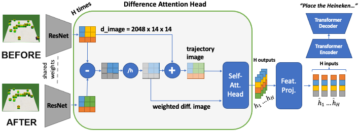
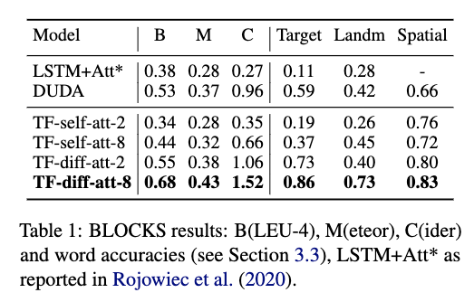
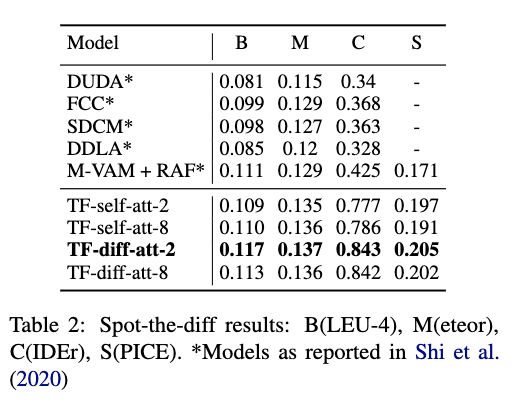

# Generating Landmark-based Manipulation Instructions from Image Pairs

This repository is the official implementation of [Generating Landmark-based Manipulation Instructions from Image Pairs](#). 



## Abstract

We investigate the problem of generating landmark-based manipulation instructions (e.g.
move the blue block so that it touches the red block on the right) from image pairs showing a
before and an after state in a visual scene. We present a transformer model with difference
attention heads that learns to attend to target and landmark objects in consecutive images via
a difference key. Our model outperforms the state-of-the-art for instruction generation on the
BLOCKS dataset and particularly improves the accuracy of generated target and landmark ref-
erences. Furthermore, our model outperforms state-of-the-art models on a difference spotting dataset.

## Requirements

To install requirements:

```setup
pip install -r requirements.txt
```

## Dataset

The BLOCKS Data Set can be found on [Blocks](https://groundedlanguage.github.io/) The data set comes with a split into **logos** and **digits**. For training the respective models in the experiments
the **logos** split has been used.

The dataset contains the following material:

```
devset.img 
testset.img 
trainset.img 
devset.json 
testset.json 
trainset.json 
```

The *.img-folders contain the single before and after images of the problem-solution-sequences. The *.json-files contain
the respective instruction for a before and after image pair.

## Pre-Processing

In pre-processing the dataset is split into train/validate/test dataset. Each split is saved into an .hdf5-file.

For training a CaptionDataset Class is inherited from Pytorch's Dataset Class providing all necessary funcionality for getting items during training and evaluation.

The preprocessing steps are contained in *./utils/preprocessing.py* and describe the way the images are served within the CaptionDataset Class. Image pairs and captions can be derived from the Data Set class as single before and after image and caption or as concatenated ones.

When pre-processing the data set make sure to adjust the **paths** in the script to your local paths in the environment you use.

The ./utils/preprocessing.py-script can be run as follows:

```
$> python ./utils/preprocessing.py
```

The output of the pre-processing-script are the following files:

```
TEST_CAPLENS_blocks2D_logos_9_cap_per_img_pair_1_min_word_freq.json
TEST_CAPTIONS_blocks2D_logos_9_cap_per_img_pair_1_min_word_freq.json
TEST_IMAGES_AFTER_blocks2D_logos_9_cap_per_img_pair_1_min_word_freq.hfd5
TEST_IMAGES_BEFORE_blocks2D_logos_9_cap_per_img_pair_1_min_word_freq.hdf5
TRAIN_CAPLENS_blocks2D_logos_9_cap_per_img_pair_1_min_word_freq.json
TRAIN_CAPTIONS_blocks2D_logos_9_cap_per_img_pair_1_min_word_freq.json
TRAIN_IMAGES_AFTER_blocks2D_logos_9_cap_per_img_pair_1_min_word_freq.hfd5
TRAIN_IMAGES_BEFORE_blocks2D_logos_9_cap_per_img_pair_1_min_word_freq.hdf5
VAL_CAPLENS_blocks2D_logos_9_cap_per_img_pair_1_min_word_freq.json
VAL_CAPTIONS_blocks2D_logos_9_cap_per_img_pair_1_min_word_freq.json
VAL_IMAGES_AFTER_blocks2D_logos_9_cap_per_img_pair_1_min_word_freq.hfd5
VAL_IMAGES_BEFORE_blocks2D_logos_9_cap_per_img_pair_1_min_word_freq.hdf5
WORDMAP_blocks2D_logos_9_cap_per_img_pair_1_min_word_freq.json
```

## Models

### Nearest Neighbor Baseline Model

A natural language instruction is generated by the baseline model in the following way: The model uses vector distance-based image retrieval as its action principle. The Euclidean distance between the targeted input image representing a scene to describe and all images of the training data set is computed and the one with the smallest distance, the nearest neighbor, is picked out. The found nearest neighbor is a concatenated image labeled with 9 captions. Out of these 9 captions one is randomly chosen and put out as instruction.

### DUDA

To generate an instruction the DUDA model receives a before and after image, encodes them into latent space, and computes the latent difference image. Upon that, in both images, differences are noted by the dual attention mechanism and then both fed into the dynamic speaker. The speaker decides on where to initially look at to produce a chronologically correct utterance which is then processed by a sequence generating LSTM and put out. For optimizing the output sequence analogously to the image captioning model beam search is applied.

### Transformer No-Attention Image Embedding

The Transformer Model in the No-Attention Image Embedding Variation uses no attention mechanism to focus specific parts of the encoded before and after images. The encoded before and the encoded after image are directly fed into the visual word network which reduces the encoded image size to the size of d_model, which is 512. The experiment was conducted with varying the length of the input, using before and after image as a starting point **(called TF-no-att-2)** and an artificially extended version which mimicks a transition from before image to after image using 8 intermediate images **(called TF-no-att-8)**.

### Transformer Self-Attention Image Embedding

The Transformer Model in the Self-Attention Image Embedding Variation uses a dot-product self-attention mechanism to focus specific parts of the encoded before and after images. After that the attended before and the after image are fed into the visual word network which reduces the encoded image size to the size of d_model, which is 512. The experiment was conducted with varying the length of the input, using before and after image as a starting point **(called TF-self-att-2)** and an artificially extended version which mimicks a transition from before image to after image using 8 intermediate images **(called TF-self-att-8)**.

### Transformer Difference-Attention Image Embedding

The Transformer Model in the Change-Attention Image Embedding Variation uses a dot-product change-attention mechanism to focus specific parts of the encoded before and after images. After that the attended before and the after image are fed into the visual word network which reduces the encoded image size to the size of d_model, which is 512. The experiment was conducted with varying the length of the input, using before and after image as a starting point **(called TF-diff-att-2)** and an artificially extended version which mimicks a transition from before image to after image using 8 intermediate images **(called TF-diff-att-8)**.

## Training

The *./training*-folder contains all conducted experiments in separate .py-files.

The processing steps are documented within the code.

The files are named after the trained model architecture: train_[MODEL_NAME].py

To train a model the DataSet Class has to be provided, a correct path to the train, validation and test set as well as a path for saving the final model .pth file. Furthermore the pytorch resnet101 model pre-trained on the ImageNet data set has to be loaded.

Make sure to adjust the **paths** to your local paths in your environment.

Run experiments always from the top directory to ensure the paths are valid:

To train the model(s) in the paper, run this command:

```
$> python ./training/train_[MODEL_NAME].py
```

Train Nearest Neighbor Baseline Model

The nearest neighbor baseline model uses as it's model the training data set. In training it computes for every image
pair of the test data set the nearest neighbor out of the training data set and saves the results in a dictionary. Make
sure to specify a **path** in the script referring to your local environment for where to save the resulting dictionary.

The training can be run using:

```
$> python ./training/train_nearest_neighbor_baseline.py
```

### Train DUDA

Make sure to specify a **path** in the *./utils/duda_utils.py*-script referring to your local environment for where to save the resulting [MODEL_NAME].pth-file.

The training can be run using:

```
$> python ./training/train_duda.py
```

### Train Transformer No-Attention Image Embedding

Make sure to specify a **path** in the *./utils/transformer_utils.py*-script referring to your local environment for where to save the resulting [MODEL_NAME].pth-file. Feel free to vary the number of images created in mimicking the transition and observe the effects.

The training can be run using:

```
$> python ./training/train_transformer_no_att.py
```

### Train Transformer Self-Attention Image Embedding

Make sure to specify a **path** in the *./utils/transformer_utils.py*-script referring to your local environment for where to save the resulting [MODEL_NAME].pth-file. Feel free to vary the number of images created in mimicking the transition and observe the effects.

The training can be run using:

```
$> python ./training/train_transformer_self_att.py
```

### Train Transformer Change-Attention Image Embedding

Make sure to specify a **path** in the *./utils/transformer_utils.py*-script referring to your local environment for where to save the resulting [MODEL_NAME].pth-file. Feel free to vary the number of images created in mimicking the transition and observe the effects.

The training can be run using:

```
$> python ./training/train_transformer_diff_att.py
```

## Evaluation

The *./evaluation*-folder contains the evaluation scripts for calculating the **BLEU-4, METEOR and CIDER** scores based on **pycocoevalcap.py**.

Make sure to install the pycocoevalcap-repository by using:

```
$> pip3 install "git+https://github.com/salaniz/pycocoevalcap.git"
```

For making it possible to evaluate the reasoning ability of the model metrics for **target detection ratio**, **landmark detection ratio** and **spatial overlap ratio** are defined and provided within the script.

Evaluation Nearest Neighbor Baseline Model

Before running the nearest neighbor baseline model evaluation script make sure to provide the correct **path** to the
nearest neighbor dictionary in the *eval_nearest_neighbor_baseline.py*-script.

The evaluation script can be run by using:

```
$> python ./evaluation/eval_nearest_neighbor_baseline.py
```

### Evaluation DUDA Model

Before running the DUDA evaluation script make sure to provide the correct **path** to the trained DUDA model/latest
checkpoint in the *eval_duda.py*-script.

The evaluation script can be run by using:

```
$> python ./evaluation/eval_duda.py
```

### Evaluation Transformer No-Attention Image Embedding

Before running the Transformer evaluation script make sure to provide the correct **path** to the respectively trained
Transformer model/latest checkpoint in the *eval_transformer_no_att.py*-script.

The evaluation script can be run by using:

```
$> python ./evaluation/eval_transformer_no_att.py
```

### Evaluation Transformer Self-Attention Image Embedding

Before running the Transformer evaluation script make sure to provide the correct **path** to the respectively trained
Transformer model/latest checkpoint in the *eval_transformer_self_att.py*-script.

The evaluation script can be run by using:

```
$> python ./evaluation/eval_transformer_self_att.py
```

### Evaluation Transformer Difference-Attention Image Embedding

Before running the Transformer evaluation script make sure to provide the correct **path** to the respectively trained
Transformer model/latest checkpoint in the *eval_transformer_self_att.py*-script.

The evaluation script can be run by using:

```
$> python ./evaluation/eval_transformer_diff_att.py
```

## Results

Our model achieves the following performance on :

### BLOCKS



### Spot-the-diff



## Citation

If you used our paper or this repository in your research and you are interested in citing it here's how you do it:

```
@Misc{,
    author = {Sina Zarrieß, Henrik Voigt, David Schlangen and Philipp Sadler},
    title = {Generating Landmark-based Manipulation Instructions from Image Pairs},
    year = {2022},
    url = {https://github.com/clp-research/diff-att-transformer}
}
```

## Acknowledgements

We want to thank the anonymous reviewers for their comments. This research/work was partially
funded by the Deutsche Forschungsgemeinschaft (DFG, German Research Foundation) ? 423217434 (RECOLAGE) grant.

The author wants to thank Sigor Vinodababu and Qiu Yue for providing well-documented repositories and structured tutorials for learning and experimentation.

Some code of the experiments was developed based on:

```
https://github.com/sgrvinod/a-PyTorch-Tutorial-to-Image-Captioning
https://github.com/qiuyue1993/RobustChangeCaptioning
https://github.com/sgrvinod/a-PyTorch-Tutorial-to-Machine-Translation
```
